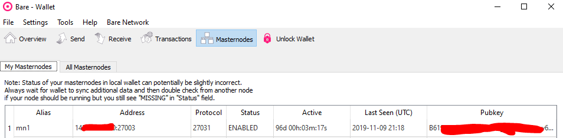

### Howto install a BARE Masternode

# Requirements:
- a VPS with 1vcore, 1GB RAM, 25GB Disk [use vultr team link](https://www.vultr.com/?ref=8316564-4F)
- a [Bare Wallet](https://github.com/BareCrypto/bare-core/releases/latest)
- 1000 BARE
- around 30 mins of time :)

# Deploy VPS on Vultr:

1 Register an account on [vultr](https://www.vultr.com/?ref=8316564-4F)

2 Load account (first pay with creditcard, paypay, wechat or Alipay from second pay with Bitcoin too)

3 Deploy new instance:
	
- use Cloud Compute

	
- choose location

	
- select server type (Ubuntu 16.04 or 18.04)

	
- select size

	
- finaly deploy now

		
- this server can host more than one coin node, 
  so if you setup a bare node you can deploy up to 4 other coinnodes here (depends on resources needed by nodes)

4 Now we go to BARE wallet:

- create a receivement:

	
- copy address from next screen:

	
- send collateral of 1,000 BARE (you need around 0.0006 BARE as tx fee)

	
- wait for minimum 6 blocks to confirm transaction
	
- now open debug console:

	
- enter following commands:
		
		masternode genkey
		masternode outputs
		
to generate needed keys
	
5 login to server via SSH 
[help](https://www.howtogeek.com/311287/how-to-connect-to-an-ssh-server-from-windows-macos-or-linux/)

6 download script: 
- Ubuntu 16.04:
	
		wget https://raw.githubusercontent.com/BareCrypto/bare-mn-script/master/install_bare16.sh

- Ubuntu 18.04:
	
		wget https://raw.githubusercontent.com/BareCrypto/bare-mn-script/master/install_bare18.sh

- run script with

		sudo bash install_bare16.sh 
		or 
		sudo bash install_bare18.sh
	
7 if ready check state of blockchain with 

		bare-cli mnsync status 

to check Sync Completed TRUE.
	
8	go to your masternode.conf file

	
insert all given data from debug console and vps in this sheme:
	
		ALIAS IP:27003 masternodegenkey masternodeoutput index
	
looks like this:
	
		mn1 127.0.0.2:27003 93HaYBVUCYjEMeeH1Y4sBGLALQZE1Yc1K64xiqgX37tGBDQL8Xg 2bcd3c84c84f87eaa86e4e56834c92927a07f9e18718810b92e0d0324456a67c 0
			
save and close file.

9 restart your wallet, unlock it!

10 go to debug console and type 

		masternode start-alias false ALIAS
	
11 Masternode tab shows now your node

	
12 Wait around 5 minutes to check on VPS with

		bare-cli masternode status

13 that's it :) Welcome to Masternode holders in BARE 

feel free to donate a coffee ^^

BARE: BRHpoWnrmoHB3uj7oAcZ39kkPZ5aJsYSkb
BTC: 1NNYZUxfLHBXCC8HNoMXJwZ7LVzrKJZBR6